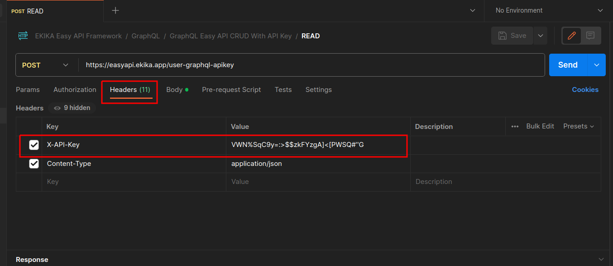
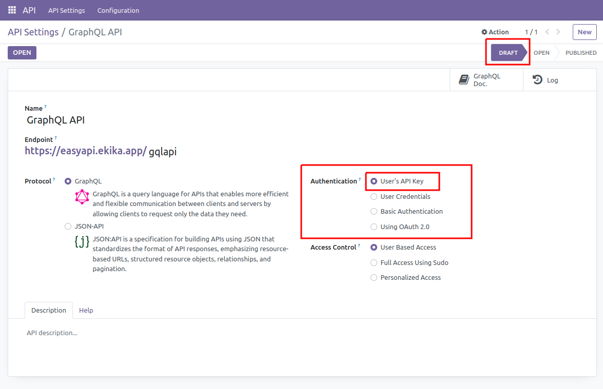
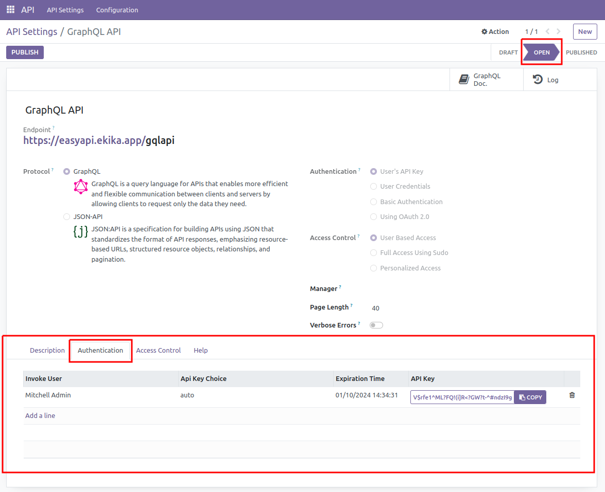

# API-Key Authentication

This module serves as a fundamental building block within the API Framework. To implement API-key based authentication in your API configuration system, it is essential to integrate this module. Keep in mind that this module is not designed to function independently; it relies on the API Framework Base (api_framework_base) as its foundation to seamlessly operate with various API authentication mechanisms.

## Auth API-Key Introduction

API-Key authentication is a simple and effective way to secure your API endpoints by requiring clients to include an API key in the request headers. This authentication method ensures that only authorized users can access your API resources.

## How It Works

When making a request to an API endpoint that requires authentication, clients must include an **X-API-Key** header in the HTTP request. The value of this header should be the API key provided to the client by the API provider.

**Headers**

|Key|Value|
|:-------:|:----------------:|
|X-API-Key|Your-API-key-value|

## Example

**Here's an example using cURL:**
```
curl -X GET "https://api.example.com/resource" -H "X-API-Key: your_api_key_here"
```

**Here's an example using Python:**
```python
import requests

# Replace 'your_api_key_here' with your actual API key
api_key = 'your_api_key_here'
api_url = 'https://api.example.com/resource'

# Make an authenticated GET request
headers = {
    'X-API-Key': api_key
}

response = requests.get(api_url, headers=headers)
```



## Configuring API-Key Authentication




