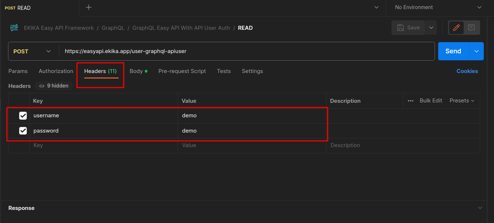
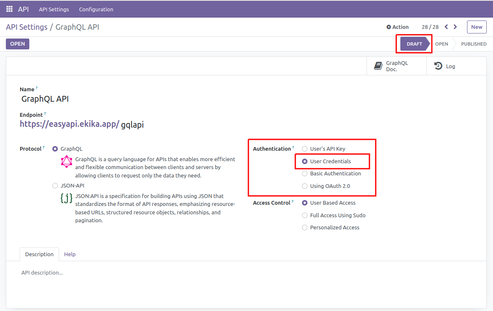

# User Authentication


## Introduction

The user authentication API requests using username and password headers. By following these instructions, developers can ensure secure communication with the API server.

## How It Works

The user authentication works by sending a username and password in the HTTP request header. The server challenges the client with a 401 Unauthorized response, indicating that authentication is required. The client then includes the username and password in the Authorization header of subsequent requests.

**Headers**

|Key|Value|
|:------:|:-----------:|
|username|your-username|
|password|your-password|


## Example

**Here's an example using cURL:**
```
curl -X GET \
  -H "username: your-username" \
  -H "password: your-password" \
  https://api.example.com/resource
```

**Here's an example using Python:**
```python
import requests

api_url = 'https://api.example.com/resource'

# Make an authenticated GET request
headers = {
    'username': 'your-username',
    'password': 'your-password',
}

response = requests.get(api_url, headers=headers)
```



## Configuring API-User Authentication


