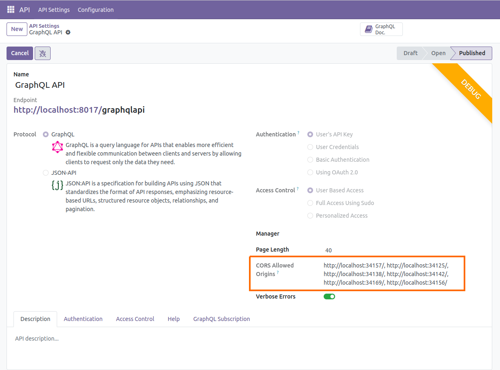
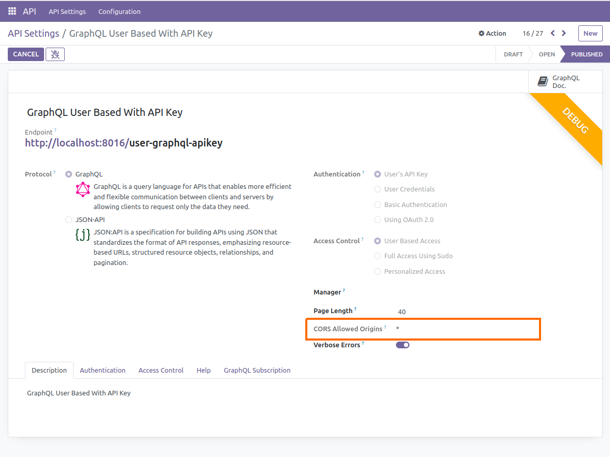

# API CORS Configuration

API CORS Configurator empowers you to seamlessly integrate APIs across different domains. By configuring CORS policies accurately, you ensure that your applications can securely access resources from disparate origins, fostering a more interconnected and efficient ecosystem.

CORS Configurator simplifies this process, offering a user-friendly interface to configure CORS policies with ease. With just a few clicks, developers can define allowed origins, ensuring secure access to resources across different domains and fostering a more interconnected and efficient ecosystem.

## Configuring CORS Origin

**1. To allow specified origins:**

**2. To allow all origins:**

