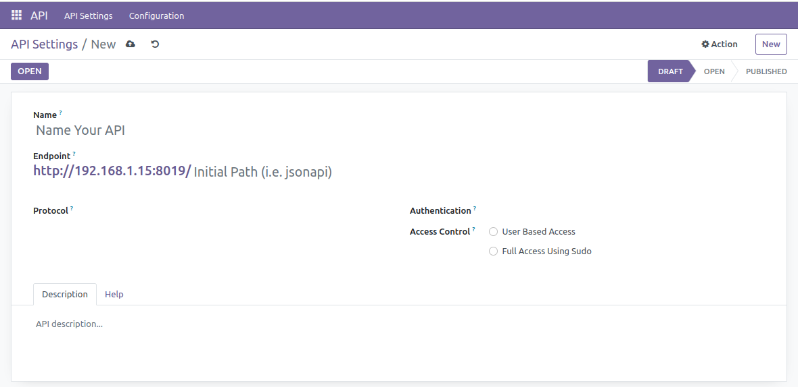

# Base API

> **Note:**
>
> This module only provide base structure for API. This module provides basic support structure for your api system. In standalone usage case you need to develop your own authentication and API format protocol. When you go with our bundle framework you will have multiple things to play with for details on bundle module check following link.
>
> If you are a developer and do not want GraphQL / JsonAPI with this framework in that you should buy this module. Otherwise you should buy full bundle you cannot use this module standalone without any implementation or authentication, authorization and protocol.
>
> **Bundle App: https://apps.odoo.com/apps/modules/15.0/api_framework/**

## Introduction

An innovative solution designed to revolutionize your API management experience. Our software stands at the forefront of API-based technology, offering a comprehensive suite of features meticulously crafted to streamline and enhance your API interactions.

One of its standout components is the API Dispatcher, a powerful tool that efficiently manages incoming requests, ensuring they are routed to the appropriate endpoints with speed and precision.

By using our API Dispatcher you can make various types of API format.

Security is paramount in today's digital landscape, and our product addresses this need through its sophisticated API Authentication system. Employing state-of-the-art protocols and authentication mechanisms, it fortifies your API infrastructure, safeguarding sensitive data and preventing unauthorized access.

It redefines the way APIs are utilized, providing a comprehensive solution that empowers developers, businesses, and enterprises to maximize their potential in a connected digital ecosystem

## How to plug new Authentication?

- Define your ``_auth_method_{your_auth_type}`` method in odoo model ``ir.http``. 
- This authentication is considered from the ``authentication_type`` field of your API record so based on that you have to act according. 
- Lastly, use the ``auth='api'`` parameter in the http.route() method for your controller.

## How to new plug API Protocol / Schema / Architecture?
- Define your API class with the parent class ``EasyAPI``, which is provided in this module. 
- Lastly, use the ``type='api`` parameter in the http.route() method for your controller.

## Screenshots

