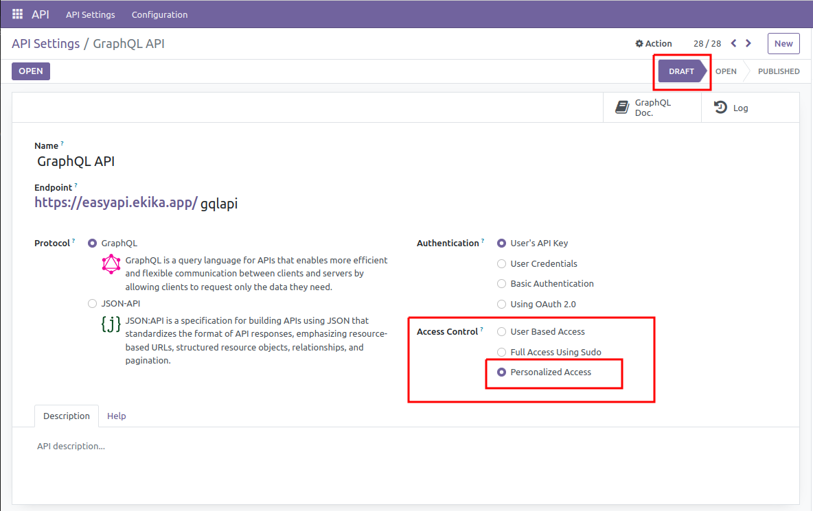
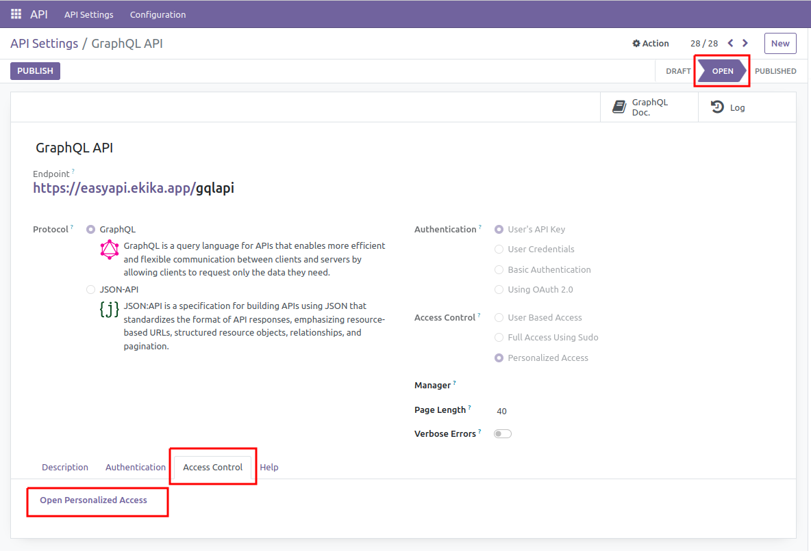
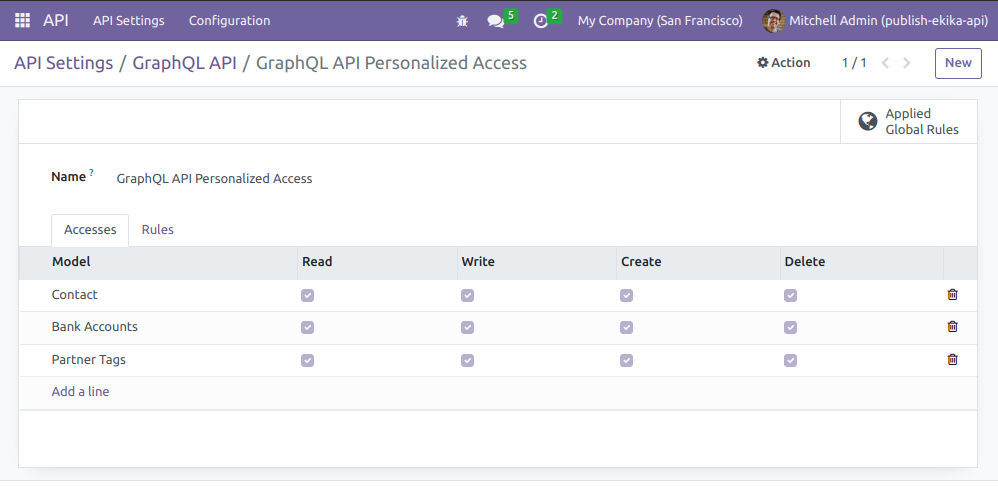

# Api Resource Access

## Introduction

This module is used to provide personlized access for particular API. It works for access purpose only not for an authentication process.

## How it works

- We just have to provide models and its permissions on particular API. 
- specific group and user is created for using personalized access which is assigned when creating model access.
- when using API, personalized access specific user is assigned after authentication. 
- Then, Every operation is performed by that personalized access specific user.

## Note

- User must have ``base.group_erp_manager`` group access in order to create API and custom model accesses.
- user and group are created for each personalized access record.
- You can also define record-rules for each personalized access.

## Configuring API-Resorce-Access:

