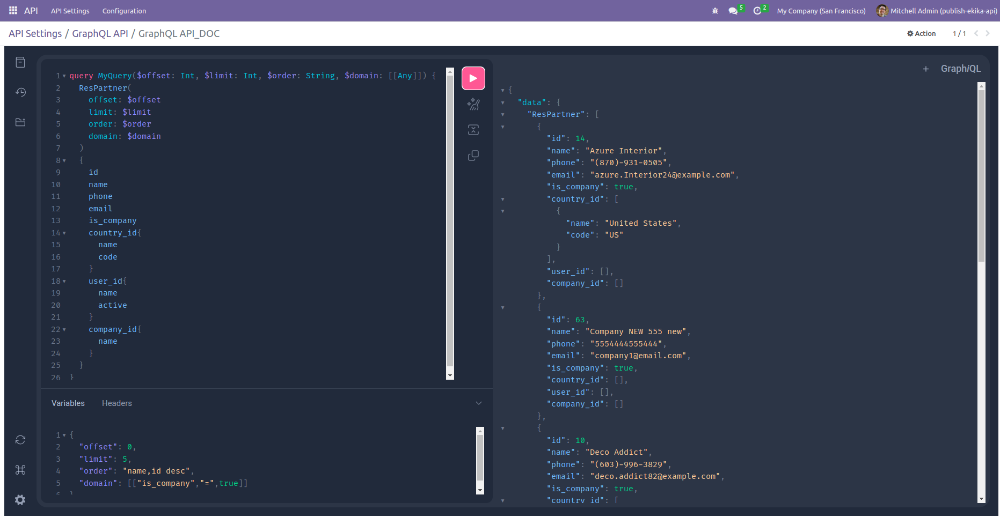
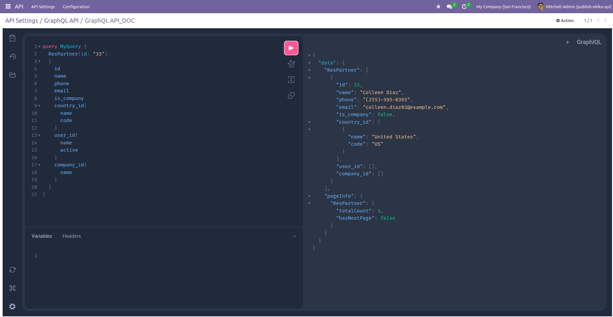
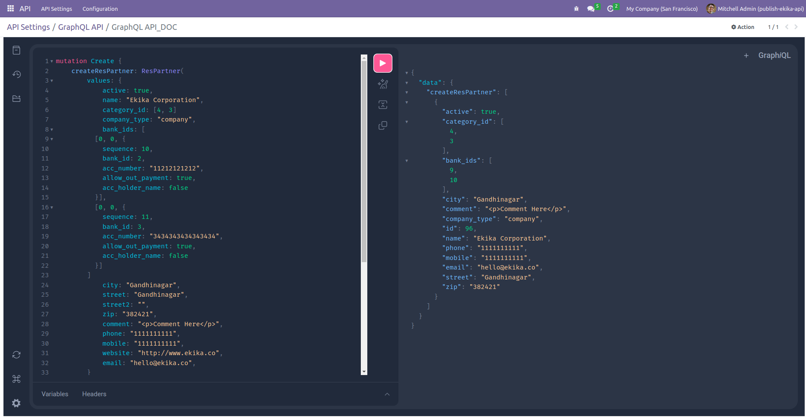
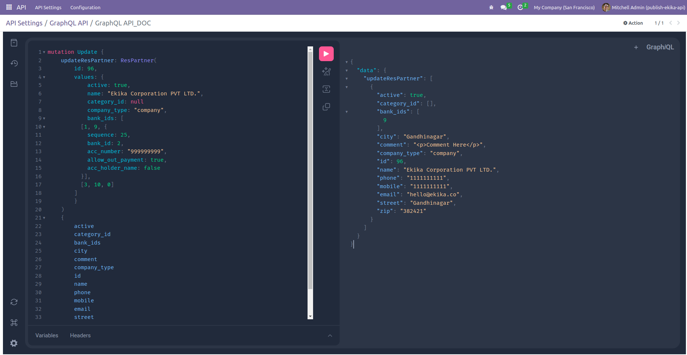
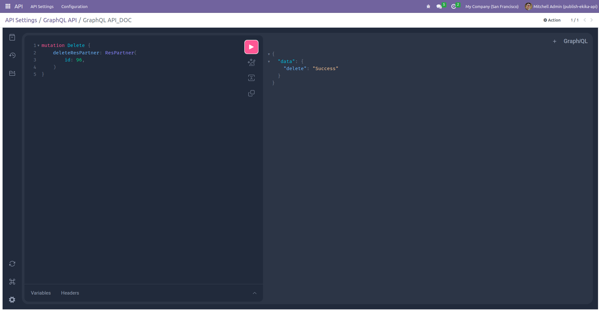
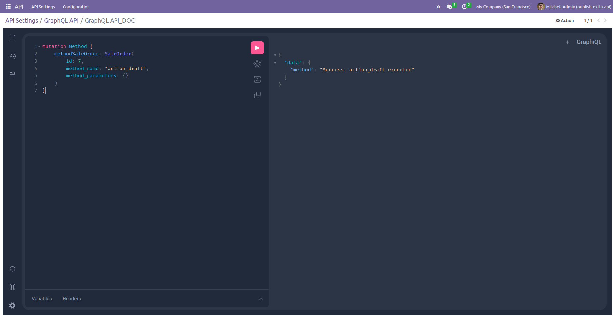
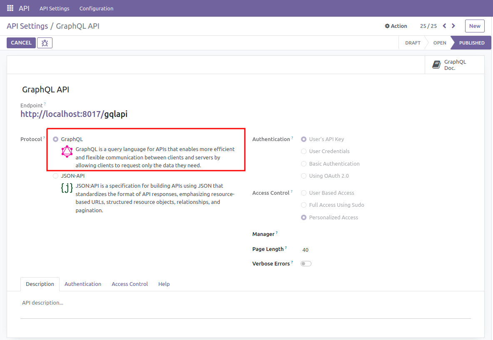

---
header-includes:
  - '<link rel="preconnect" href="https://fonts.googleapis.com">'
  - '<link rel="preconnect" href="https://fonts.gstatic.com" crossorigin>'
  - '<link href="https://fonts.googleapis.com/css2?family=Quicksand:wght@500&display=swap" rel="stylesheet">'
  - '<style>
      p,li,h1,h2 {font-family: "Quicksand", sans-serif;}
    </style>'
---

# Odoo GraphQL API

## Introduction

GraphQL is a query language for APIs and a runtime for executing those queries with existing data.

 1. **Declarative Data Fetching:** 
    GraphQL allows clients to request only the data they need and nothing more. Clients can specify the shape and structure of the response, reducing the over-fetching and under-fetching of data that often occurs in REST APIs.

 2. **Hierarchical Structure:** 
    GraphQL queries have a hierarchical structure, mirroring the shape of the response data. Clients can request nested fields, and the server responds with a JSON object that matches the requested structure.

 - GraphQL Specification: https://graphql.org/learn/

## How It Works
In GraphQL, queries and mutations are two types of operations used to interact with the API:

1. **Query Operation:** 
    A query in GraphQL is used to read or fetch data from the server. Clients can specify exactly what data they need, and the server will return only the requested data, no more and no less. Queries are similar to GET requests in REST APIs.



```gql
query MyQuery($offset: Int, $limit: Int, $order: String, $domain: [[Any]]) {
   ResPartner(
      offset: $offset
      limit: $limit
      order: $order
      domain: $domain
   )
   {
      id
      name
      phone
      email
      is_company
      country_id{
         name
         code
      }
      user_id{
         name
         active
      }
      company_id{
         name
      }
   }
}
```
   ```json
   GRAPHQL Variables for above query
   {
      "offset": 0,
      "limit": 5,
      "order": "name,id desc",
      "domain": [["is_company","=",true]]
   }
   ```



```gql
query MyQuery {
  ResPartner(id: "33")
  {
    id
    name
    phone
    email
    is_company
    country_id{
      name
      code
    }
    user_id{
      name
      active
    }
    company_id{
      name
    }
  }
}
```

2. **Mutation Operation:** 
    A mutation in GraphQL is used to modify data on the server. Mutations are similar to POST, PUT, PATCH, or DELETE requests in REST APIs. Mutations can be used for creating, updating, or deleting records.

- **Create Operation**:




```gql
mutation Create {
    createResPartner: ResPartner(
      values: {
         active: true,
         name: "Ekika Corporation",
         category_id: [4, 3]
         company_type: "company",
         bank_ids: [
            [0, 0, {
               sequence: 10,
               bank_id: 2,
               acc_number: "11212121212",
               allow_out_payment: true,
               acc_holder_name: false
            }],
            [0, 0, {
               sequence: 11,
               bank_id: 3,
               acc_number: "3434343434343434",
               allow_out_payment: true,
               acc_holder_name: false
               }]
         ]
         city: "Gandhinagar",
         street: "Gandhinagar",
         street2: "",
         zip: "382421",
         comment: "<p>Comment Here</p>",
         phone: "1111111111",
         mobile: "1111111111",
         website: "http://www.ekika.co",
         email: "hello@ekika.co",
      }
    )
    {
        active
        category_id
        bank_ids
        city
        comment
        company_type
        id
        name
        phone
        mobile
        email
        street
        zip
    }
}
```
- **Update Operation:**



```gql
mutation Update {
    updateResPartner: ResPartner(
        id: 96, 
        values: {
            active: true,
            name: "Ekika Corporation PVT LTD.",
            category_id: null
            company_type: "company",
            bank_ids: [
               [1, 9, {
                  sequence: 25,
                  bank_id: 2,
                  acc_number: "999999999",
                  allow_out_payment: true,
                  acc_holder_name: false
               }],
               [3, 10, 0]
            ]
        }
    )
    {
        active
        category_id
        bank_ids
        city
        comment
        company_type
        id
        name
        phone
        mobile
        email
        street
        zip
    }
}
```
- **Delete Operation:**



```gql
mutation Delete {
    deleteResPartner: ResPartner(
        id: 96, 
    )
}
```

- **Method Execution:**



```gql
mutation Method {
    methodSaleOrder: SaleOrder(
        id: 7, 
        method_name: "action_draft",
        method_parameters: {}
    )
}
```

## Configuring GraphQL Setting:



## References
GraphQL Specification: https://graphql.org/learn/
