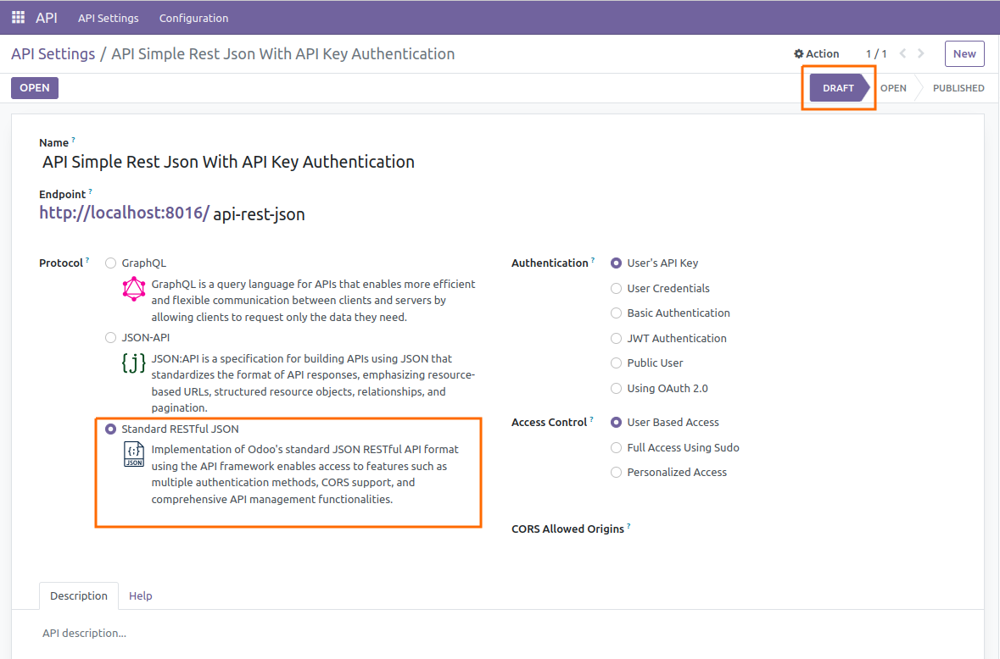
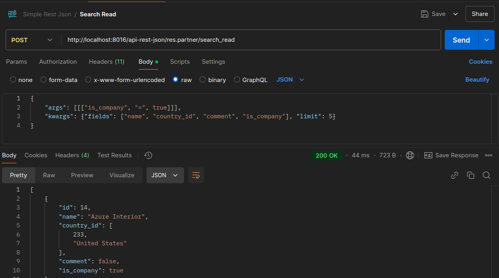
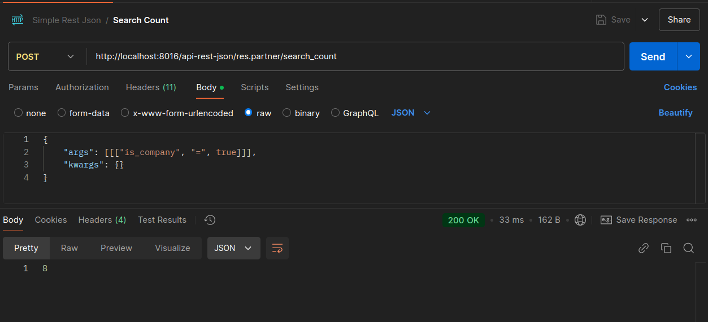
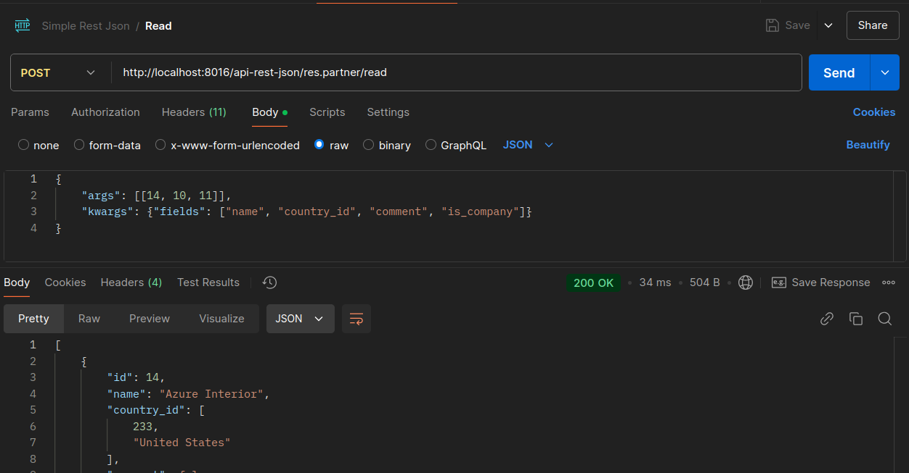
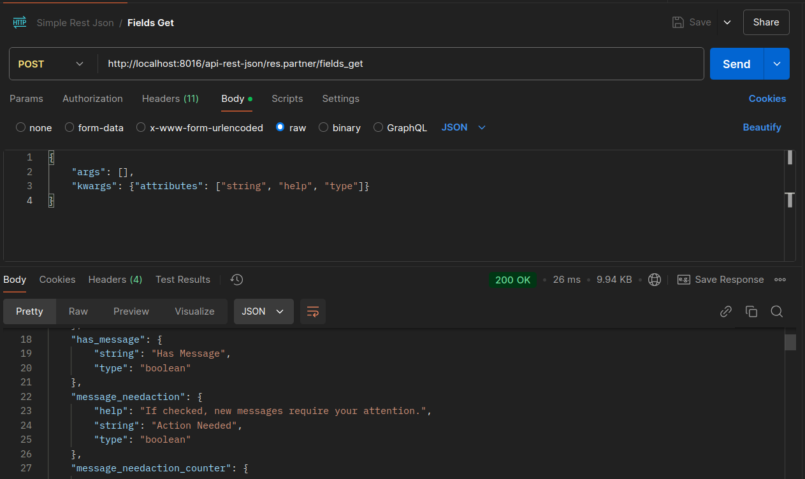
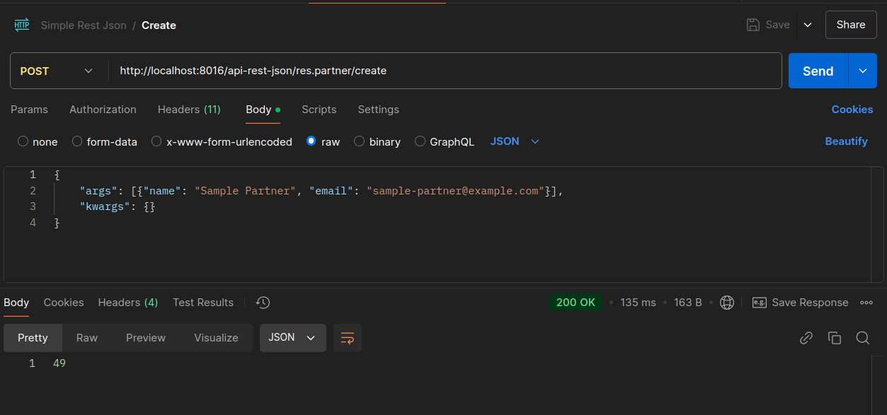
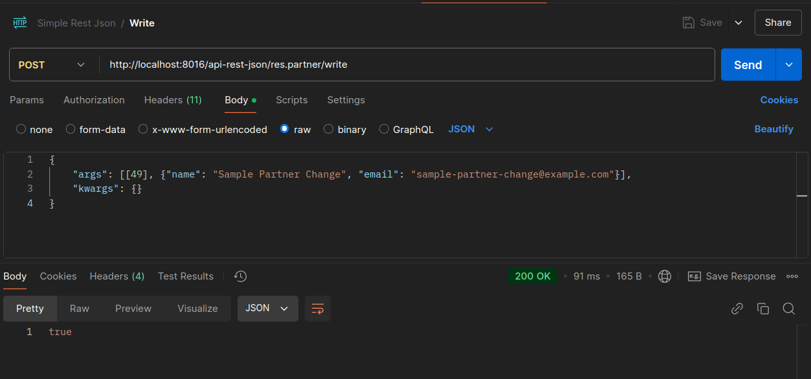
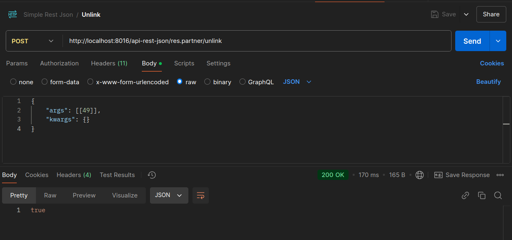

# Easy Rest Json

## Introduction

This module’s support for Odoo’s JSON RESTful API format allows you to perform a variety of RPC operations with versatile authentication options, along with advanced framework features.

## How It Works

By defining a standard structure for API requests and responses, this module promotes consistency and ease of use. Below are several request examples:

### Configuring API



### Requests

- **Search**


```python
import requests
import json

url = "http://localhost:8016/api-rest-json/res.partner/search"

payload = json.dumps({
  "args": [
    [
      [
        "is_company",
        "=",
        True
      ]
    ]
  ],
  "kwargs": {}
})
headers = {
  'Content-Type': 'application/json',
  'x-api-key': 'YOUR-API-KEY'
}

response = requests.request("POST", url, headers=headers, data=payload)

print(response.text)
```

- **Search Read**



```python
import requests
import json

url = "http://localhost:8016/api-rest-json/res.partner/search_read"

payload = json.dumps({
  "args": [
    [
      [
        "is_company",
        "=",
        True
      ]
    ]
  ],
  "kwargs": {
    "fields": [
      "name",
      "country_id",
      "comment",
      "is_company"
    ],
    "limit": 5
  }
})
headers = {
  'Content-Type': 'application/json',
  'x-api-key': 'YOUR-API-KEY'
}

response = requests.request("POST", url, headers=headers, data=payload)

print(response.text)
```

- **Search Count**



```python
import requests
import json

url = "http://localhost:8016/api-rest-json/res.partner/search_count"

payload = json.dumps({
  "args": [
    [
      [
        "is_company",
        "=",
        True
      ]
    ]
  ],
  "kwargs": {}
})
headers = {
  'Content-Type': 'application/json',
  'x-api-key': 'YOUR-API-KEY'
}

response = requests.request("POST", url, headers=headers, data=payload)

print(response.text)
```

- **Read**



```python
import requests
import json

url = "http://localhost:8016/api-rest-json/res.partner/read"

payload = json.dumps({
  "args": [
    [
      14,
      10,
      11
    ]
  ],
  "kwargs": {
    "fields": [
      "name",
      "country_id",
      "comment",
      "is_company"
    ]
  }
})
headers = {
  'Content-Type': 'application/json',
  'x-api-key': 'YOUR-API-KEY'
}

response = requests.request("POST", url, headers=headers, data=payload)

print(response.text)

```

- **Read Group**


```python
import requests
import json

url = "http://localhost:8016/api-rest-json/res.partner/read_group"

payload = json.dumps({
  "args": [
    [
      [
        "is_company",
        "=",
        False
      ]
    ]
  ],
  "kwargs": {
    "fields": [
      "name",
      "country_id",
      "comment",
      "is_company"
    ],
    "groupby": "country_id"
  }
})
headers = {
  'Content-Type': 'application/json',
  'x-api-key': 'YOUR-API-KEY'
}

response = requests.request("POST", url, headers=headers, data=payload)

print(response.text)
```

- **Fields Get**



```python
import requests
import json

url = "http://localhost:8016/api-rest-json/res.partner/fields_get"

payload = json.dumps({
  "args": [],
  "kwargs": {
    "attributes": [
      "string",
      "help",
      "type"
    ]
  }
})
headers = {
  'Content-Type': 'application/json',
  'x-api-key': 'YOUR-API-KEY'
}

response = requests.request("POST", url, headers=headers, data=payload)

print(response.text)
```

- **Check Access Right**


```python
import requests
import json

url = "http://localhost:8016/api-rest-json/res.partner/check_access_rights"

payload = json.dumps({
  "args": [
    "create"
  ],
  "kwargs": {}
})
headers = {
  'Content-Type': 'application/json',
  'x-api-key': 'YOUR-API-KEY'
}

response = requests.request("POST", url, headers=headers, data=payload)

print(response.text)

```

- **Create**



```python
import requests
import json

url = "http://localhost:8016/api-rest-json/res.partner/create"

payload = json.dumps({
  "args": [
    {
      "name": "Sample Partner",
      "email": "sample-partner@example.com"
    }
  ],
  "kwargs": {}
})
headers = {
  'Content-Type': 'application/json',
  'x-api-key': 'YOUR-API-KEY'
}

response = requests.request("POST", url, headers=headers, data=payload)

print(response.text)
```

- **Write**



```python
import requests
import json

url = "http://localhost:8016/api-rest-json/res.partner/write"

payload = json.dumps({
  "args": [
    [
      49
    ],
    {
      "name": "Sample Partner Change",
      "email": "sample-partner-change@example.com"
    }
  ],
  "kwargs": {}
})
headers = {
  'Content-Type': 'application/json',
  'x-api-key': 'YOUR-API-KEY'
}

response = requests.request("POST", url, headers=headers, data=payload)

print(response.text)

```

- **Unlink**



```python
import requests
import json

url = "http://localhost:8016/api-rest-json/res.partner/unlink"

payload = json.dumps({
  "args": [
    [
      49
    ]
  ],
  "kwargs": {}
})
headers = {
  'Content-Type': 'application/json',
  'x-api-key': 'YOUR-API-KEY'
}

response = requests.request("POST", url, headers=headers, data=payload)

print(response.text)
```
