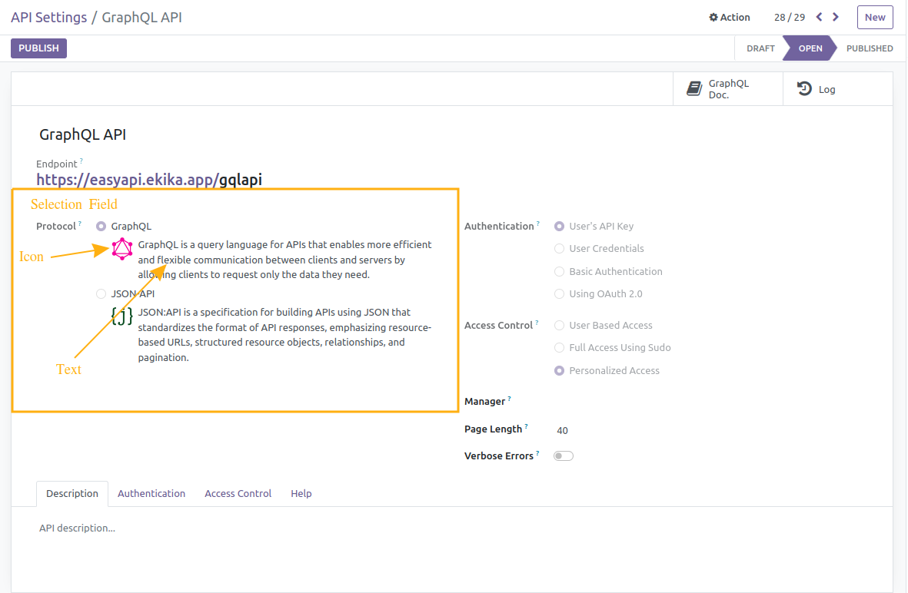

# Ekika Widgets

> **Note:**
>
> This module only provides widgets for our main products. This is used only in dependence on our main product, so we are not recommending you buy this module alone. Check out the following link for our main product.
>
> If you are a developer and you want to use this module, then you can buy this module alone.
>
> **Main Product: https://apps.odoo.com/apps/modules/15.0/api_framework/**

## Introduction

The ultimate widget solution. Ekika Widgets empowers developers to effortlessly create captivating and responsive interfaces. Optimized for performance and accessibility across devices, Ekika Widgets ensures seamless user experiences.

## Radio Details Widget

- This widget is for selection field only
- provide widget="radio_detail" in field attribute. 
    - e.g. ``<field name="selection_field_name" widget="radio_detail"/>``
- This widget display two things, text and icon.
- you have to provide field attribute value for text and icon like below examples:
    -   ```xml
        <attribute name="{selection_field_value1}_text" position="add">Text Value Here</attribute>

        <attribute name="{selection_field_value1}_icon" position="add">[IMAGE-LINK-HERE] e.g,http://example.org/img/logo.png</attribute>
        ```
- **Screenshot**:

    
