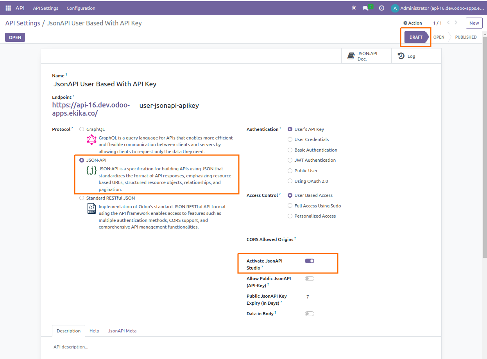
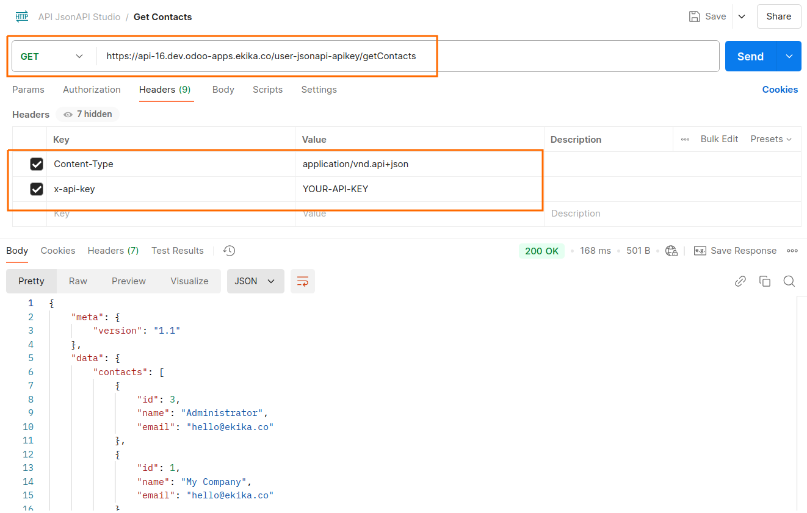
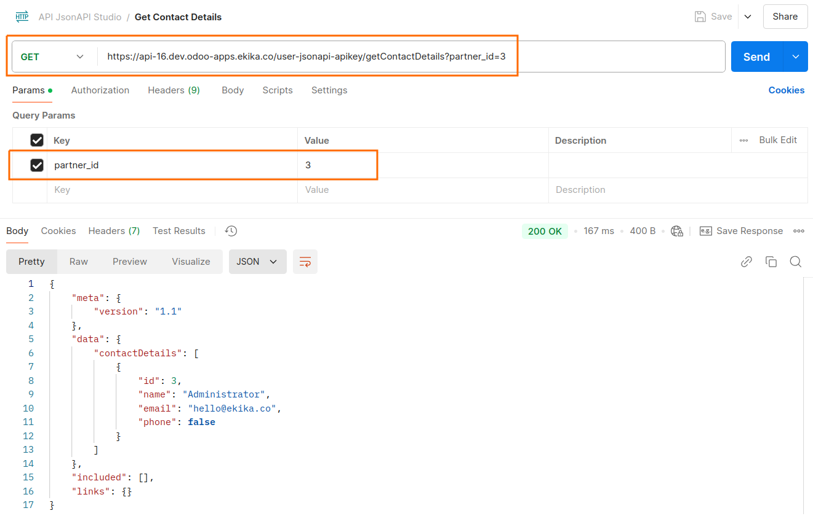
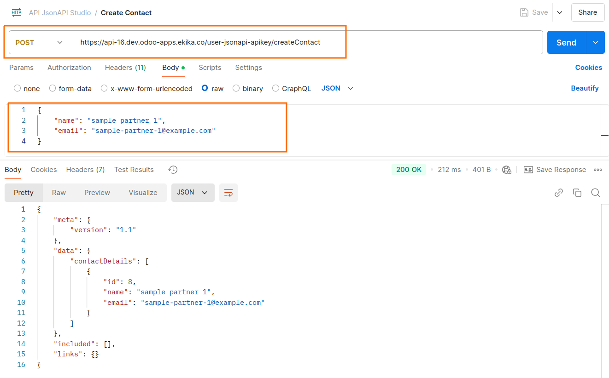
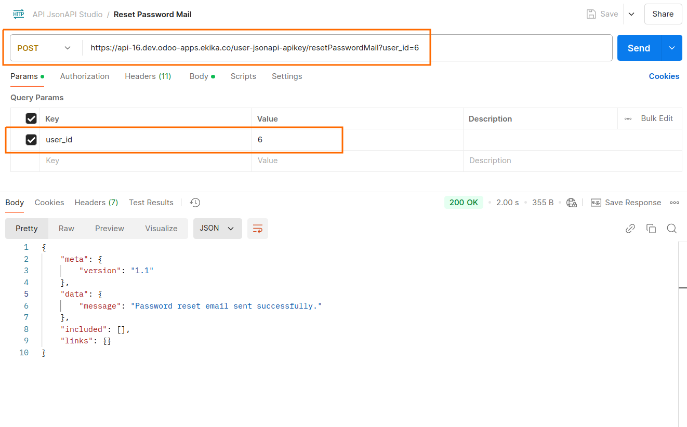

# JsonAPI Studio

## Introduction

This module allows you to write your own Custom API Endpoints using JsonAPI. Here you can use various features of api_framework like different authentication, CORS configurations etc.

## Configuring API




## How It Works

 - To create a custom API endpoint, define methods within the **easy.jsonapi.customstudio** model. You can find the relevant file at: */models/custom_jsonapi_studio.py*.

 - Use the **def my_custom_jsonapis(cls)** method to define your endpoint. Ensure the method returns a list of endpoints.

 - Define a method matching one of the names in the list above. Ensure it accepts *query(JsonAPIQuery)* as a parameter.

 - The methods you implement must return a dictionary object, and this object should contain at least the **data** or **errors** key. you may contain **links** and **included** in dictionary, for more information Refer [**JsonAPI**](https://jsonapi.org/format/1.1/).

 - Access your defined custom endpoints using the following format: *{your-web-domain[:port]}/{your-api-endpoint}/{your-custom-endpoint}*.

 - For more detail please refer below examples:

```python
import json
from odoo import models
from odoo.http import request
from odoo.addons.easy_jsonapi.models.easy_jsonapi import JsonAPIQuery


class MyJsonAPICustomStudio(models.AbstractModel):
    _inherit = 'easy.jsonapi.customstudio'

    @classmethod
    def my_custom_jsonapis(cls):
        res = super().my_custom_jsonapis()
        res.extend([
            'getContacts',
            'getContactDetails',
            'createContact',
            'resetPasswordMail'
        ])
        return res

    @classmethod
    def getContacts(cls, query: JsonAPIQuery) -> dict:
        try:
            partners = request.env['res.partner'].search_read([], fields=['name', 'email'])
            result = {'data': {'contacts': partners}}
        except Exception as exc:
            result = {'errors': exc.args}
        return result

    @classmethod
    def getContactDetails(cls, query: JsonAPIQuery) -> dict:
        try:
            partner = request.env['res.partner'].browse(int(query.params['partner_id']))
            result = {'data': {'contactDetails': partner.read(fields=['name', 'email', 'phone'])}}
        except Exception as exc:
            result = {'errors': exc.args}
        return result

    @classmethod
    def createContact(cls, query: JsonAPIQuery) -> dict:
        try:
            data = json.loads(request.httprequest.get_data(as_text=True))
            partner = request.env['res.partner'].create({'name': data['name'], 'email': data['email']})
            result = {'data': {'contactDetails': partner.read(fields=['name', 'email'])}}
        except Exception as exc:
            result = {'errors': exc.args}
        return result

    @classmethod
    def resetPasswordMail(cls, query: JsonAPIQuery) -> dict:
        try:
            user = request.env['res.users'].browse(int(query.params['user_id']))
            user.action_reset_password()
            result = {'data': {'message': 'Password reset email sent successfully.'}}
        except Exception as exc:
            result = {'errors': {'message': 'Failed to send the password reset email.'}}
        return result

```

### Request Considering above Examples

**Get Contacts**



```python
import requests
import json

url = "https://api-16.dev.odoo-apps.ekika.co/user-jsonapi-apikey/getContacts"

payload = {}
headers = {
  'Content-Type': 'application/vnd.api+json',
  'x-api-key': 'YOUR-API-KEY'
}

response = requests.request("GET", url, headers=headers, data=payload)

print(response.text)

```

**Get Contact Details**



```python
import requests
import json

url = "https://api-16.dev.odoo-apps.ekika.co/user-jsonapi-apikey/getContactDetails?partner_id=3"

payload = {}
headers = {
  'Content-Type': 'application/vnd.api+json',
  'x-api-key': 'YOUR-API-KEY'
}

response = requests.request("GET", url, headers=headers, data=payload)

print(response.text)

```

**Create Contact**



```python
import requests
import json

url = "https://api-16.dev.odoo-apps.ekika.co/user-jsonapi-apikey/createContact"

payload = json.dumps({
  "name": "sample partner 1",
  "email": "sample-partner-1@example.com"
})
headers = {
  'Content-Type': 'application/vnd.api+json',
  'x-api-key': 'YOUR-API-KEY'
}

response = requests.request("POST", url, headers=headers, data=payload)

print(response.text)
```

**Reset Password Mail**



```python
import requests
import json

url = "https://api-16.dev.odoo-apps.ekika.co/user-jsonapi-apikey/resetPasswordMail?user_id=6"

payload = {}
headers = {
  'Content-Type': 'application/vnd.api+json',
  'x-api-key': 'YOUR-API-KEY'
}

response = requests.request("POST", url, headers=headers, data=payload)

print(response.text)
```